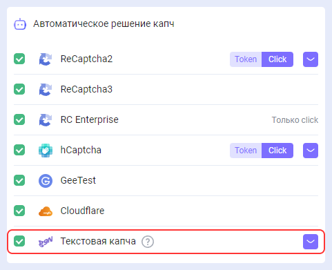
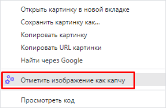

---
sidebar_position: 2
---

# Решение текстовых капч
## **Описание**
В наше расширение для браузера была добавлена возможность распознавания текстовых каптч.

 
## **Как это работает**
### **Действия в браузере**
1. Кликните правой кнопкой мыши на капче и в открывшемся меню выберите "Отметить изображение как капчу".

 

2. Кликните правой кнопокй мыши по полю для ввода ответа и в открывшемся меню выберите "Выбрать поле для результата капчи".

 

3. Результат автоматически прописывается в поле для ввода ответа.

 
### **Автоматизация распознавания через ПО**
Для автоматизации процесса распознавания текстовых капч в браузере (например, с использованием *Инструмента разработчика* или *Selenium*) необходимо:

1. Назначить атрибут `cm-image-to-text-source="id"` на элемент с картинкой:

 

2. Назначить атрибут `cm-image-to-text-input-result="id"` на элемент с инпутом:

 

Где "id" - идентификатор капчи (произвольное значение).
:::info 
При этом у соответствующих друг другу капчи и инпута должен быть один и тот же id.

Можно разгадывать параллельно несколько капч на странице, главное, чтобы id в рамках одного набора был уникальный и id капчи и инпута соответствовали друг другу.
:::
