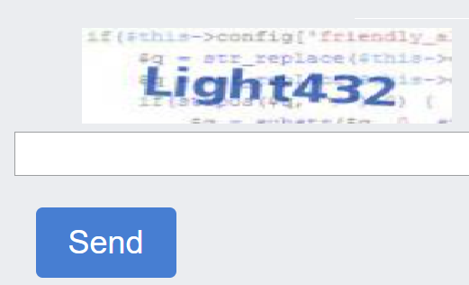

---
sidebar_position: 10
sidebar_label: ImageToTextTask
---

# ImageToTextTask

This is a regular captcha, which is an image with text to be entered into the corresponding line. 



## **Object structure**

|**Parameter**|**Type**|**Required**|**Possible values**|**Description**|
| :-: | :-: | :-: | :-: | :-: |
|type|String|yes|**ImageToTextTask**|Defines the type of the task.|
|body|String|yes|-|File body encoded in base64*. Make sure to send it without line breaks.|
|CapMonsterModule|String|no|yandex, special and others|The name of recognizing module, for example, “yandex“. Alternative way to pass module name and list of all available modules you can find [here](../api/module-name.md).|
|recognizingThreshold|Int|no|0-100|Captcha recognition threshold with a possible value from 0 to 100. For example, if recognizingThreshold was set to 90 and the task was solved with a confidence of 80, you won't be charged. In this case the user will get a response ERROR_CAPTCHA_UNSOLVABLE.|
|Case|Boolean|no|true, false|true - if captcha is case sensitive.|
|numeric|Int|no|0, 1|1 - if captcha contains numbers only.|
|math|Boolean|no|true, false|false — undefined;<br />true — if captcha requires a mathematical operation (for example: captcha 2 + 6 = will return a value of 8).|

*Base64 is a data encoding method that allows you to represent binary data as text. Here is an example of obtaining a captcha image in base64 format using the console in the *Developer Tools*:

```
const captchaUrl = 'https://example.com/captcha.jpg';

function loadAndEncodeCaptchaToBase64(url) {
    fetch(url)
        .then(response => response.blob())
        .then(blob => {
            const reader = new FileReader();
            reader.readAsDataURL(blob);

            reader.onloadend = function() {
                const base64Data = reader.result;                
                console.log('Base64 Encoded Captcha:', base64Data);

                          };
        })
        .catch(error => {
            console.error('Error occurred while loading or encoding the captcha:', error);
        });
}

loadAndEncodeCaptchaToBase64(captchaUrl);

```


## **Request example**

:::info Method
```http
https://api.capmonster.cloud/createTask
```
:::
```json
{
  "clientKey":"67b6bcbb1a728ea8d563de6d169a2057",
  "task": {
    "type":"ImageToTextTask",
    "body":"BASE64_BODY_HERE!"
  }
}
```


**Response example**
```json
{
  "errorId":0,
  "taskId":53456
}
```

## **Getting the result**
:::info Method
```http
https://api.capmonster.cloud/getTaskResult
```
:::
Use the [getTaskResult](../api/methods/get-task-result.md) method to get the captcha solution. Depending on the system load, you will receive an answer within an interval from 300ms to 6s

|**Property**|**Type**|**Description**|
| :-: | :-: | :-: |
|text|String|Captcha answer|

**Example:**
```json
{
  "errorId":0,
  "status":"ready",
  "solution": {
    "text":"answer"
  }
}
```
