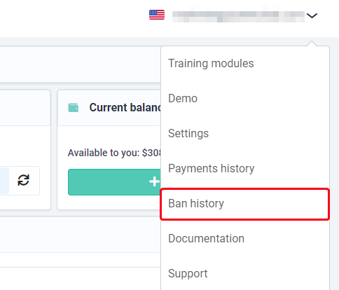

# 封禁原因
## **如何找出封禁的原因？**
如果被封禁，您将在您的[个人账户](https://capmonster.cloud/Dashboard)看到通知。
封禁历史记录可在设置中查看。

## **封禁的主要原因：**

- **KeyDoesntExist**（未提供密钥或使用无效密钥进行多次请求）
- **ZeroBalance**（余额为零进行多次请求）
- **WrongTaskId**
  - 超过每个任务的120次请求限制
  - 使用错误的TaskId进行多次getTaskResult请求
- **BadProxy**（使用被封禁的代理进行多次请求）

用户因重复违规行为会被封禁一段有限的时间。
## **封禁将何时解除？**

封禁时间为10分钟，前提是您不再继续违反上述规则。

  

    我经常被封禁。我应该怎么办？
  

原因是您的应用程序/脚本发送了多个错误的API请求。

**我是用户**

如果您不是发送验证码的应用程序/脚本的开发者，请联系他们的支持团队，并解释验证码识别服务因多次错误请求而封禁您的情况（详细阅读封禁原因的解释）。

**我是开发者**

如果您是开发者，请按照规则和限制进行以下更改：

- 确保您的应用程序或脚本向API发送正确的请求。确保所有参数正确，包括密钥、任务ID和其他必需的数据。

- 遵守验证码识别服务设定的每个任务的请求数量限制和其他限制。如果您的应用程序发送了过多的请求，可能会导致封禁。

- 确保您使用可靠的代理服务器，以避免因使用被封禁的代理而导致封禁。

要查看有效查询的示例，请参阅[Captcha Types](https://docs.capmonster.cloud/docs/captchas)。

  

