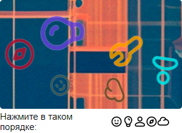

---
sidebar_position: 12
sidebar_label: ComplexImageTask YSC
draft: true
---

# ComplexImageTask YSC

该对象包含有关解决 Yandex SmartCaptcha 任务的数据。

**图片示例**



## **对象结构**

|**参数**|**类型**|**必填**|**可能的值**|**描述**|
| :- | :- | :- | :- | :- |
|type|String|是|ComplexImageTask|定义任务对象类型。|
|class|String|是|yandexsmartcaptcha|定义任务对象类。|
|imagesBase64|Array|是|[ “iVBORw0KGgoAAAANSUhEUgAAASwLbb” ]|包含一个以 base64 格式的图像的列表。|

## **请求示例**

:::info 方法
```http
https://api.capmonster.cloud/createTask
```
:::

```json
{
    "clientKey": "b06025dbcd87ee02a315f0faadefa63c",
    "task": {
        "type": "ComplexImageTask",
        "class": "yandexsmartcaptcha",
        "imagesBase64": ["iVBORw0KGgoAAAANSUhEUgAAASwLbb..."]
    }
}
```

**响应示例**
```json
{
    "errorId":0,
    "taskId":407533072
}
```

## **获取结果**

使用 [getTaskResult](../api/methods/get-task-result.md) 方法获取验证码的解决方案。根据系统负载，您将在从300毫秒到6秒不等的时间范围内收到响应。

|**属性**|**类型**|**描述**|
| :- | :- | :- |
|answer|Array|坐标列表。|
|metadata|Null|不提供有用信息。|

**示例**

```json
{
	"solution": {
		"answer": [
			{
				"X": 98,
				"Y": 140
			},
			{
				"X": 103,
				"Y": 54
			},
			{
				"X": 273,
				"Y": 117
			},
			{
				"X": 32,
				"Y": 89
			},
			{
				"X": 189,
				"Y": 149
			}
		],
		"metadata": null
	},
	"cost": 0.0002,
	"status": "ready",
	"errorId": 0,
	"errorCode": null,
	"errorDescription": null
}
```

## **定价**

|**名称**|**每1000张图片成本, $**|
| :- | :- |
|**Yandex SmartCaptcha** (点击)|0.2|

## **图片格式**
该任务的验证码以一张图片的形式发送。在Yandex服务中，尺寸为300x220，在外部网站上为320x220。<br/>
从图像到包含任务文本的容器的距离应为4像素（上边距）。原始距离为13像素。


## **使用 ZennoPoster**

我们需要准备一个任务，截取元素的屏幕截图，并发送到CapMonster Cloud进行识别。<br/>

为了准备发送和接收以base64格式的图片的任务，您可以使用以下C#代码片段：<br/>

```csharp
// 找到具有任务的元素（在上面截图中用下边框突出显示）
HtmlElement taskContainer = instance.ActiveTab.FindElementByXPath("//div[@class=\"AdvancedCaptcha-SilhouetteTask\"]", 0);
 // 设置适当的样式
taskContainer.SetAttribute("style", "margin-top: 4px;");

// 找到包含主要图片的容器 
HtmlElement image = instance.ActiveTab.FindElementByXPath("//div[@class=\"AdvancedCaptcha AdvancedCaptcha_silhouette\"]", 0);
 // 获取所需大小的base64格式图片
 return image.DrawPartToBitmap(0, 0, 300, 220, false)；
```

如果将执行操作的结果保存到*imageBase64*变量中，那么发送POST请求到*/createTask*将如下所示：

<details>
    <summary>"POST请求" 设置以将验证码发送到CapMonster Cloud</summary>


</details>

收到结果后，您可以使用以下C#代码片段单击坐标：

```csharp
// 获取放置结果的变量值
 // 从/getTaskResult返回
string jsonStr = project.Variables["cmcloudTaskResult"].Value;
 // 上传JSON
 project.Json.FromString(jsonStr);

// 找到包含任务的容器并获取其坐标
 HtmlElement imageContainer = instance.ActiveTab.FindElementByXPath("//div[@class=\"AdvancedCaptcha AdvancedCaptcha_silhouette\"]", 0);
 int imageContainerX = int.Parse(imageContainer.GetAttribute("left"));
 int imageContainerY = int.Parse(imageContainer.GetAttribute("top"));

for (int i = 0; i < project.Json.solution.answer.Count; ++i) {
	int X = Convert.ToInt32(project.Json.solution.answer[i].X);
	int Y = Convert.ToInt32(project.Json.solution.answer[i].Y);
	
	// 需要将来自服务的坐标添加到元素坐标中，
	// 因为我们发送的不是整个页面进行识别，
	// 而是特定的包含验证码的容器
	instance.ActiveTab.FullEmulationMouseMove(imageContainerX + X, imageContainerY + Y);
	instance.ActiveTab.FullEmulationMouseClick("left", "click");
}

// 提交验证码
HtmlElement submitBtn = instance.ActiveTab.GetDocumentByAddress("0").FindElementByTag("form", 0).FindChildByAttribute("span", "class", "CaptchaButton-SubmitContent", "regexp", 0);
instance.ActiveTab.FullEmulationMouseMoveToHtmlElement(submitBtn);
instance.ActiveTab.FullEmulationMouseClick("left", "click");
```

[最终测试项目](https://drive.google.com/drive/folders/1QNNcBXBGjGZMc6AQ7bdYtr4YEQEumxT4)（不要忘记输入您的CapMonster.Cloud的API密钥）。<br/>


## **使用其他程序**

大多数自动化框架（如Selenium/Puppeteer/Playwright等）提供了创建截图的选项。<br/>

例如，使用Playwright这样可以获取带有任务的图片：

```csharp
// 为元素设置必要的样式
const taskTextContainer = await page.locator('//div[@class="AdvancedCaptcha-SilhouetteTask"]');
await taskTextContainer.evaluate((element) => {
  element.style.marginTop = "4px";
}, {}, { timeout: 5000 });

// 获取图片
const taskContainer = await page.locator('//div[@class="AdvancedCaptcha AdvancedCaptcha_silhouette"]');
const imageWithExtraStuff = await screenshotContainer.screenshot({ scale: "css", timeout: 5000});
```

之后，您需要裁剪图片。您可以使用[sharp库](https://www.npmjs.com/package/sharp)来完成此操作：

```csharp
const sharpImageFull = sharp(imageWithExtraStuff);
const sharpImageCropped = sharpImageFull
  .trim({ background: "#FFFFFF", threshold: 0 })
  .extract({ top: 0, left: 0, height: 220, width: 300 });
```