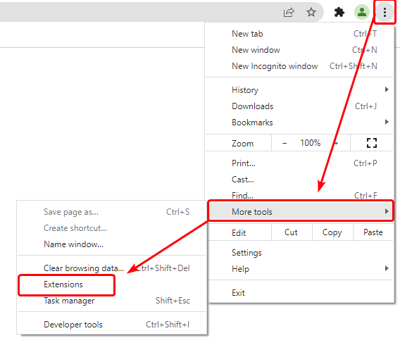
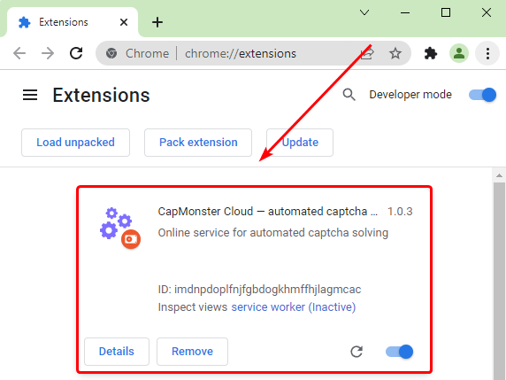
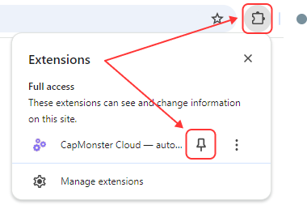

---
sidebar_position: 0
---
# Chrome 浏览器扩展
## **描述**
通过此扩展，您可以直接在浏览器中自动识别验证码。

该扩展适用于 Google Chrome 浏览器。

-----
## **自动安装**
**重要提示！** 您不能在隐身模式和访客模式下安装扩展程序。

1. 打开 [Chrome 网上应用店](https://chrome.google.com/webstore/detail/capmonster-cloud-%E2%80%94-automa/pabjfbciaedomjjfelfafejkppknjleh?hl=en)。
1. 点击 **安装**。

要开始使用扩展，请点击地址栏右侧的扩展图标。前往 [设置页面](extension-main.md#settings)。

*如果由于某些原因无法从 Chrome 网上应用店安装扩展，请使用手动安装的说明。*

手动安装

1. 下载带有扩展的[存档文件](https://drive.google.com/drive/folders/1ErdzNr6yF8g9fWpNSenaQ-93mANG6wLC?usp=drive_link)。
1. 将其解压缩到任意文件夹。

   **警告**: 请勿删除该文件夹，否则扩展将停止工作。
1. 在 Google Chrome 浏览器中打开“扩展程序”页面。有几种方法可以做到这一点：
   1. 在浏览器的地址栏中键入 chrome://extensions 并按 Enter。
   1. 从菜单中：点击右上角的三个竖点（靠近个人资料图片），然后选择“更多工具”，然后选择“扩展程序”。

3. 或者转到 Google Chrome 设置，并在右侧菜单中选择“扩展程序”（位于最底部）。

1. 启用“开发者模式”。
1. 然后点击“加载已解压的扩展程序”。

1. 找到并选择您解压缩扩展的文件夹。
1. 完成后，扩展应出现在已安装扩展的列表中。

扩展程序的手动更新

如果您正在安装扩展的更新版本，那么当您更新原始扩展文件时，还需要在“扩展程序”页面上点击更新按钮（如何打开此页面在上面的“手动安装”部分已经描述）。

-----
## **设置**

如何固定扩展

默认情况下，安装的扩展是隐藏的。要固定它，您需要点击“固定”按钮：

启动扩展后，您将看到此窗口：

### **API 密钥**
在相应的字段中输入 API 密钥(1)，点击保存按钮(2)。如果您输入了正确的密钥，您的余额将显示在下方(3)。

### **自动识别验证码**
在这里，您可以选择扩展将自动识别的验证码类型。

:::info 信息！

您可能需要重新加载带有验证码的页面以使更改生效！

:::
### **在出现错误时重复解决验证码**
如果第一次尝试解决验证码失败，扩展将发送重复的任务，直到验证码解决成功，或者直到达到此设置中指定的限制为止。
### **代理**

在这里，您可以指定将与识别任务一起发送的代理设置。

“登录”和“密码”是可选的。
### **黑名单控制**
使用黑名单，您可以配置扩展程序在特定网站上忽略验证码。

启用此选项后，将会出现一个输入网站的字段：

域名必须与协议（https://或http://）一起指定。
您可以使用通配符：

- ? - 代表除句点以外的任何字符
- \* - 代表任意数量的任何字符

示例：

|**过滤器**|**描述**|
| :-: | :-: |
|`https://zennolab.com`|禁止在 `https://zennolab.com` 网站上使用扩展|
|`https://*.zennolab.com`|禁止在所有子域名 `https://zennolab.com` 上使用扩展|
|`https://www.google.*`|禁止在 Google 的所有区域（ru、com、com.ua 等）使用扩展|

[ref1]: Aspose.Words.d14847ca-5ce8-4c9f-8081-1ec99b44a6b3.001.png

当解决验证码时发生错误，请参阅[错误术语表](/api/api-errors.md)。
