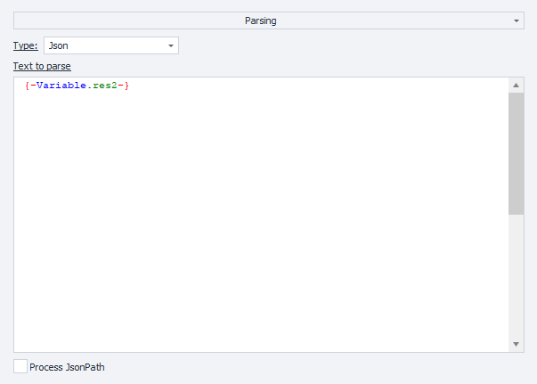

# 入门

在本节中，您可以了解如何将验证码发送到 CapMonster Cloud 以及识别它们的方法。

:::info 方法地址
```http
https://api.capmonster.cloud
```
请求格式： `JSON POST`。
响应始终采用`JSON`格式。
:::


**要解决验证码，您需要：**

1. 通过[createTask](api/methods/create-task.md)方法创建验证码任务，它将返回任务 ID。
2. 稍等片刻。根据系统负载情况，您将在 300 毫秒到 6 秒之间收到应答。
3. 使用[getTaskResult](api/methods/get-task-result.md)请求验证码解决方案。如果验证码尚未解决，请转到步骤2。

附加方法：

- [检查](api/methods/get-balance.md)账户余额。

### 代码示例

为了您的方便，我们创建了现成的库，以便将 CapMonster.Cloud API 快速集成到您的代码中。以市场最低的价格识别 reCAPTCHA、hCaptcha 和其他类型的验证码！

|**语言**|**链接至存储库**|
| :- | :- |
|С#|- [Nuget](https://www.nuget.org/packages/Zennolab.CapMonsterCloud.Client)<br /> - [Github](https://github.com/ZennoLab/capmonstercloud-client-dotnet) |
|Python|- [PyPl](https://pypi.org/project/capmonstercloudclient/)<br /> - [Github](https://github.com/ZennoLab/capmonstercloud-client-python)|
|JS|- [Npm](https://www.npmjs.com/package/@zennolab_com/capmonstercloud-client)<br /> - [Github](https://github.com/ZennoLab/capmonstercloud-client-js)|
|GO|- [Pkg.go.dev](https://pkg.go.dev/github.com/ZennoLab/capmonstercloud-client-go)<br /> - [Github](https://github.com/ZennoLab/capmonstercloud-client-go)|
|PHP|- [Packagist](https://packagist.org/packages/zennolab/capmonstercloud.client)<br /> - [Github](https://github.com/ZennoLab/capmonstercloud-client-php)|


## 识别方法

CapMonster Cloud 服务中有 2 种验证码识别方法：

1. 令牌方法。
2. 点击方法。

第一种方法（**通过令牌**）是最初的基本识别方法，您必须手动在网站页面的代码中搜索参数和函数，然后使用这些参数或脚本构建查询并执行自动提交以发送令牌并向网站发出信号，表明验证码已被解决并且需要验证正确的输入。令牌是一个独特的字符组合，是验证码解决方案成功后服务器生成的响应，用于验证验证码。自动提交-自动将令牌发送到验证码表单并确认解决方案的功能。

搜索参数例如：SiteKey（websiteKey）——用于链接验证码和目标站点的唯一标识符，网站URL——验证码所在页面的地址。

分析页面代码并发出请求后，验证码数据被发送到CapMonster Cloud服务进行识别。成功解答的结果是，发起请求的站点将收到一个代币，用于进一步进行子挖掘。用户可以在其代码中使用此方法，正确制定要发送到服务器、接收结果并确认验证码解决方案的任务。

第二种方法（**通过点击**）可以像真人一样通过真实点击来识别复杂的验证码。这就向网站证明，验证码是由人工而不是机器人识别的。此方法用于 Chrome 或 Firefox 的浏览器扩展。

这种识别方法的另一个重要优点是，无需独立搜索要发送给服务的参数和执行自动提交。 众所周知，在这一步，您可能面临一项相当严肃且耗时的任务（特别是对于编程初学者而言），即在脚本中搜索参数和函数以及请求中的数据、网站的 HTML 布局以及通常用于实现提交（验证码解决方案的确认）的脚本结构。

由于网站可能使用不同的非标准方式设置参数和实现提交功能，这个问题往往变得更加严重。例如请求中使用了较多第三方参数或者这些参数被加密等。在大多数情况下，点击解决方法可以让您绕过此类困难，而无需额外的复杂研究和实验。

在 ZennoPoster 中还有一个很好的机会来应用点击方法。为此，只需将我们的 CapMonster Cloud 扩展程序（请参阅[在 ProjectMaker 浏览器中安装 CapMonster Cloud 扩展程序的说明](extension/install-instruction.md)）安装到具有 Chromium 引擎的项目中，输入 API 密钥，然后使用该扩展程序以与通常在 Chrome 系统浏览器中完成的方式相同的方式处理该项目。

## Zennoposter 中的 Token 提交示例

使用动作：

1. 将 CapMonster Cloud 集成到 ProjectMaker（设置 - Captchas - 选择 CapMonster Cloud 模块，输入您的 API 密钥）；

2. 添加操作清除 Cookies - 转到页面（例如，对于 reCaptcha v.2 验证码类型 - [https://lessons.zennolab.com/captchas/recaptcha/v2_simple.php?level=high](https://lessons.zennolab.com/captchas/recaptcha/v2_simple.php?level=high)）  - 识别 ReCaptcha；

3. 在识别 ReCaptcha 操作的属性中，选择 CapMonsterCloud.dll 模块，指定 reCaptcha v.2 验证码类型以及**在选项卡中**或**通过 SiteKey**解决的方法：


4. 如果选择**通过 SiteKey**方法，请指定验证码数据（sitekey）和 url - 您要解决验证码的页面地址：


### reCaptcha v.3

1. 添加操作清除 cookie - 转到页面（例如 [https://lessons.zennolab.com/captchas/recaptcha/v3.php?level=beta](https://lessons.zennolab.com/captchas/recaptcha/v3.php?level=beta)） - 识别 ReCaptcha；

2. 在识别 ReCaptcha 操作的属性中，选择 CapMonsterCloud.dll 模块，指定 reCaptcha v.3 验证码类型，方法在 Tab 或 Via SiteKey 中，还指定 Action 和 minScore：


### 验证码

1. 将操作“识别 hCaptcha”添加到您的项目中，您已经导航到带有验证码的页面；

2. 在识别 hCaptcha 操作的属性中，选择 In Tab 或 Via SiteKey 方法（选择此方法时，您需要指定 SiteKey 和验证码所在的 URL）：


### 通过 HTTP 请求

对于某些验证码类型，ProjectMaker 中没有现成的操作，在这种情况下，您需要使用扩展程序或编写查询来解决验证码问题。

1. “变量处理”（“添加操作”-“数据”-“变量处理”），在属性中选择“设置值”，并在值中写入您的 CapMonster Cloud API 密钥。


2. “添加操作” - “HTTP” - “POST 请求”（如果需要，另外添加您的代理值）：


3. 添加“处理 JSON/XML”操作（“添加操作” - “数据” - “处理 JSON/XML”），在属性中选择“解析”，输入“Json”，右键单击解析文本选择“从变量设置值”：


4. 添加“变量处理”动作，在其中设置\{-Json.taskId-\}：


5. 生成新的POST请求来获取结果：


6. 在“JSON/XML 处理”操作中添加值“解析”：



7. 接下来，您需要使用“设置值”操作将令牌值替换为所需的验证码形式（通过检查页面代码），例如：

